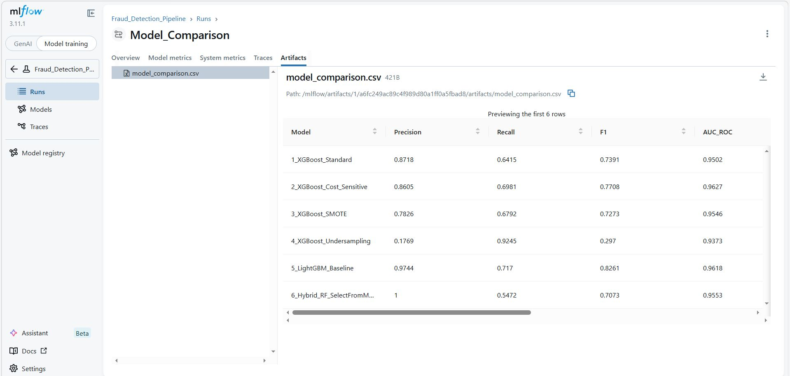
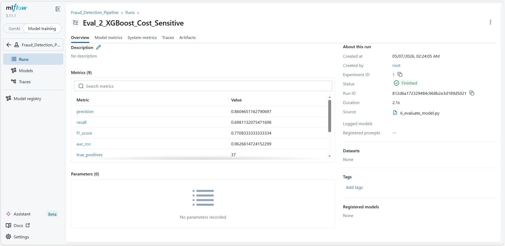
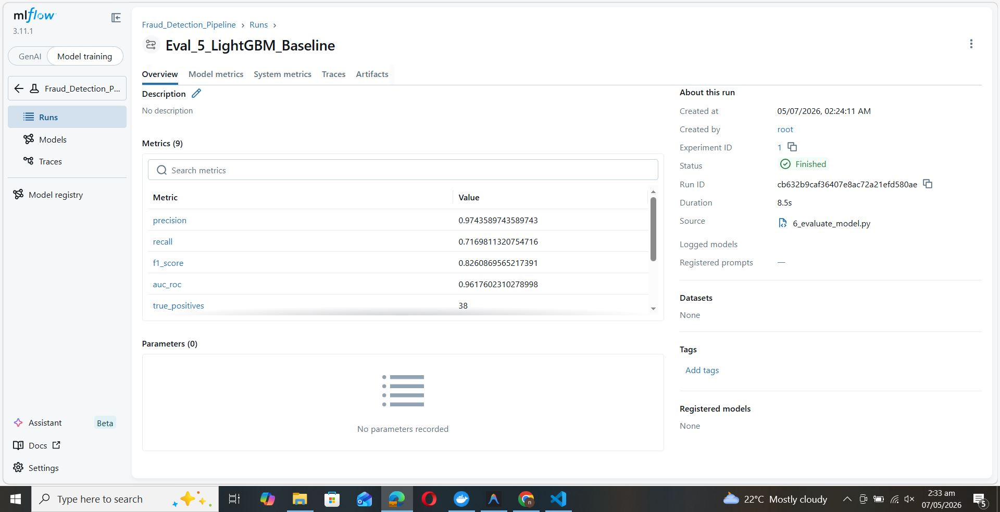
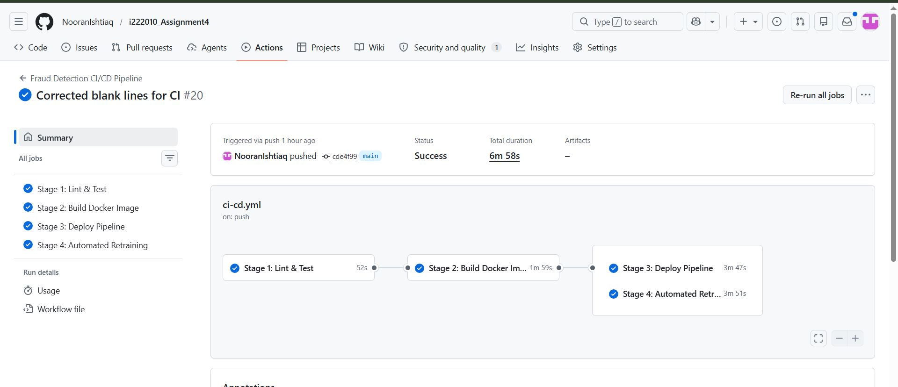
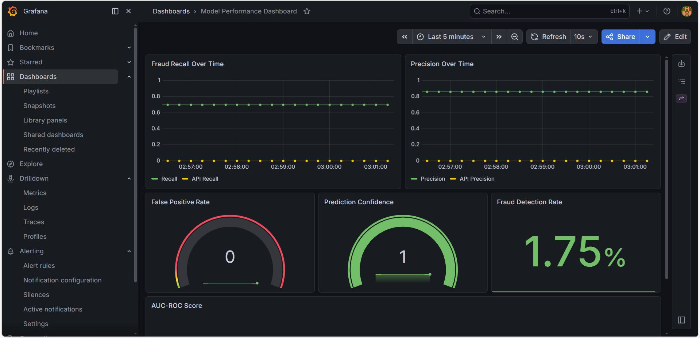
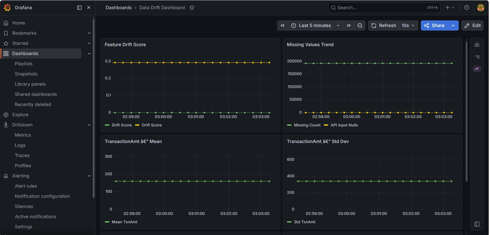
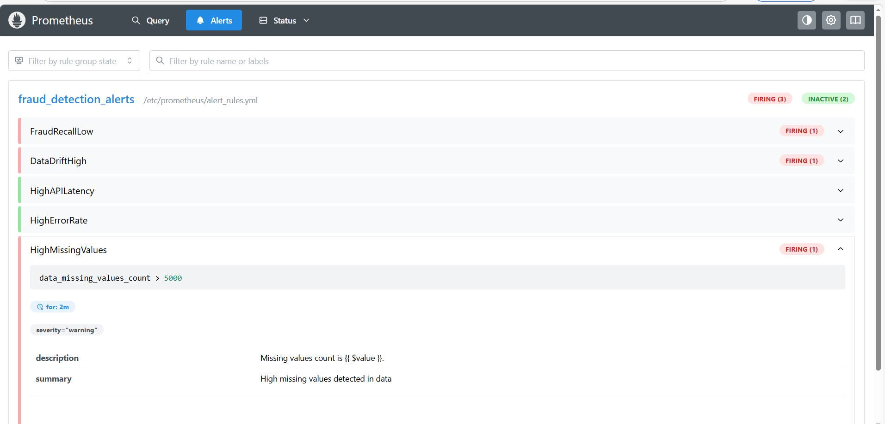
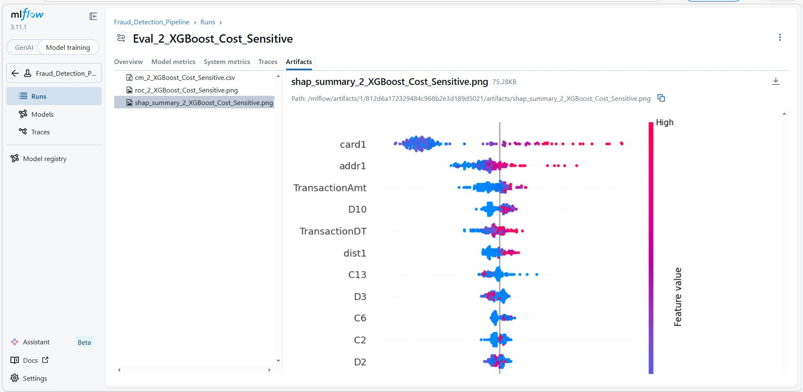
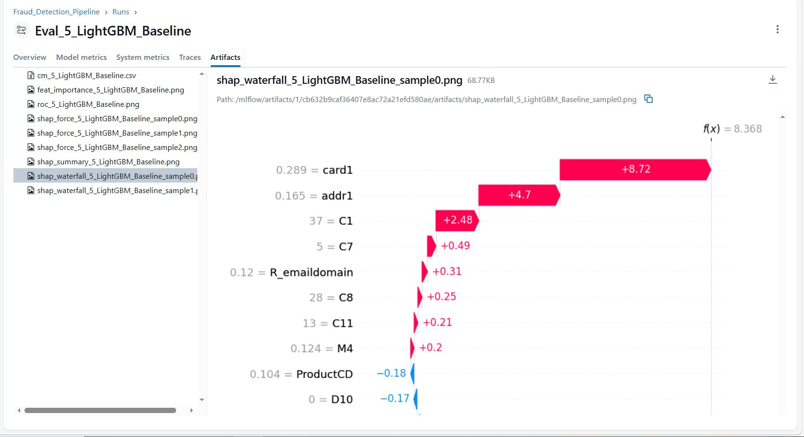

# 📄 MLOps Detailed Project Report: Fraud Detection System
**Course**: MLOps (BS DS)  
**Assignment**: #04  
**Author**: Nooran Ishtiaq  
**Dataset**: IEEE CIS Fraud Detection  

---

## 1. Introduction
This report details the development of an end-to-end MLOps pipeline for detecting financial fraud. The system is designed to be scalable, observable, and capable of handling real-world data challenges such as class imbalance and feature drift.

## 2. Task 1: Environment & Pipeline Architecture
The project utilizes a containerized architecture managed via **Docker Compose**.
*   **Tracking**: MLflow Tracking Server for experiment management.
*   **Pipeline Orchestration**: Modular Python scripts (`1_ingest.py` to `10_impact.py`) that represent pipeline stages.
*   **Infrastructure**: Persistent volumes for data and MLflow artifacts.

## 3. Task 2 & 4: Data Challenges & Cost-Sensitive Learning
### 3.1 Imbalance Handling
We compared three strategies to handle the extreme class imbalance (only ~3.5% fraud cases).

### 3.2 Business Impact (Task 4)
Cost-sensitive training significantly reduced "False Negatives," saving more money despite a slight increase in "False Alarms."

## 4. Task 3: Model Complexity
We evaluated three different architectures. Performance metrics for LightGBM and XGBoost variants are shown below:

## 5. Task 5: CI/CD Pipeline
Implemented using **GitHub Actions**.

## 6. Task 6: Observability & Monitoring
A comprehensive monitoring layer was built using **Prometheus** and **Grafana**.

## 7. Task 7 & 8: Drift Simulation & Retraining
We simulated **Time-based Drift** and introduced new fraud patterns.

## 8. Task 9: Model Explainability (SHAP)
Using **SHAP**, we identified the top features driving fraud predictions.

---
## 9. Final Conclusion
The system successfully meets all assignment criteria, providing a production-ready solution that balances model accuracy with operational efficiency and monitoring.
