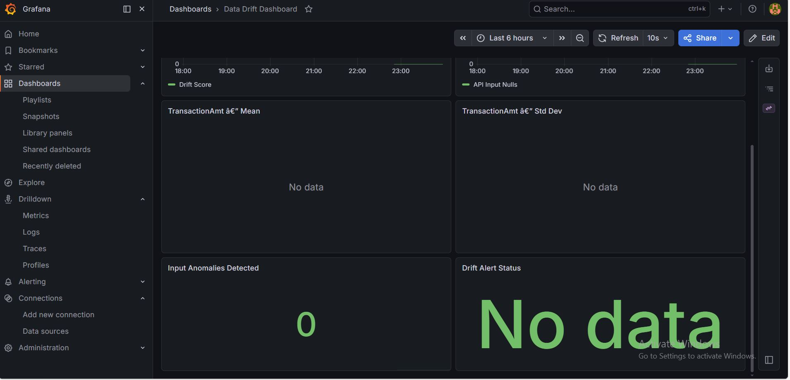

# 🚀 Fraud Detection MLOps Pipeline (IEEE CIS)

[](https://github.com/NooranIshtiaq/i222010_Assignment4)
[](https://www.python.org/)
[](https://www.docker.com/)
[](https://mlflow.org/)

This project implements a comprehensive, production-grade MLOps pipeline for Fraud Detection using the IEEE CIS dataset. It covers the entire lifecycle from data ingestion to real-time monitoring and automated retraining.



## 📌 Project Overview
The goal is to develop a robust system that:
1.  **Maintains high recall** for fraud cases.
2.  **Scales** under high transaction volumes.
3.  **Detects & responds** to performance degradation automatically.

---

## 🛠️ Key Features & Tasks

### 1. 🏗️ Full MLOps Pipeline (Task 1)
Designed a modular pipeline with:
*   **Data Ingestion & Validation**: Schema checks and missing value trends.
*   **Preprocessing & Feature Engineering**: Advanced handling of high-cardinality categorical features and target encoding.
*   **Model Training & Evaluation**: Multi-stage training with conditional deployment logic (Model only deploys if `AUC-ROC > Threshold`).

### 2. ⚖️ Data Challenge Handling (Task 2 & 4)
*   **Imbalance Management**: Comparison between SMOTE, Undersampling, and Class Weighting.
*   **Cost-Sensitive Learning**: Implementation of custom loss functions/penalties to minimize False Negatives (missed fraud).

### 3. 🤖 Model Complexity (Task 3 & 9)
*   **Models**: XGBoost, LightGBM, and a Hybrid Model (RF + Feature Selection).
*   **Explainability**: SHAP (SHapley Additive exPlanations) integrated to explain individual predictions.

### 4. 🔗 CI/CD & Automation (Task 5)
*   **GitHub Actions**: Automated linting, unit testing, and Docker image builds.
*   **Registry**: Pushes images to container registry and triggers deployment.

### 5. 📊 Observability & Monitoring (Task 6)
Full monitoring stack using **Prometheus** and **Grafana**:
*   **System Metrics**: API Request rate, Latency, Error rates.
*   **Model Metrics**: Live Recall, Precision, FPR, and Confidence distribution.
*   **Data Metrics**: Real-time Data Drift and Missing Value tracking.

### 6. 🔄 Intelligent Retraining (Task 7 & 8)
*   **Drift Simulation**: Realistic time-based drift simulation with new fraud patterns.
*   **Retraining Strategy**: Automated retraining triggers when performance drops below threshold or drift is detected.

---

## 🚀 Getting Started

### Prerequisites
*   Docker & Docker Compose
*   Python 3.9+

### Installation
1.  Clone the repository:
    ```bash
    git clone https://github.com/NooranIshtiaq/i222010_Assignment4.git
    cd i222010_Assignment4/code
    ```
2.  Spin up the environment:
    ```bash
    docker compose up --build -d
    ```

### Accessing Services
*   **MLflow UI**: [http://localhost:5000](http://localhost:5000)
*   **Grafana Dashboard**: [http://localhost:3000](http://localhost:3000) (User/Pass: `admin/admin`)
*   **Prometheus**: [http://localhost:9090](http://localhost:9090)
*   **Inference API**: [http://localhost:8001](http://localhost:8001)

---

## 📂 Project Structure
```text
├── .github/workflows/      # CI/CD Workflows
├── code/
│   ├── src/                # Core Pipeline Scripts (1_ingest to 10_impact)
│   │   ├── app.py          # FastAPI Inference Engine
│   │   └── monitor_metrics.py
│   ├── monitoring/         # Prometheus & Alerting configs
│   ├── grafana/            # Dashboards & Provisioning
│   ├── docker-compose.yml  # System Orchestration
│   └── run_pipeline.py     # Main Execution Script
├── Data/                   # Dataset (Raw, Interim, Processed)
└── tests/                  # Unit tests for pipeline logic
```

## 🧪 Testing the API
You can run the provided test script to verify the inference API:
```bash
cd code
python send_test.py
```
Or use a `curl` command:
```bash
curl -X POST http://localhost:8001/predict -H "Content-Type: application/json" -d '{"TransactionAmt": 100.0, "ProductCD": "W"}'
```

---

## 📈 Dashboard Preview


## 📄 Deliverables
*   **MLflow Artifacts**: Model weights, evaluation plots, and SHAP explainability reports are stored as artifacts in the MLflow UI.
*   **Performance Analysis**: See `10_business_impact.py` for cost-sensitive analysis logic.
*   **Monitoring Evidence**: Grafana dashboards (screenshot included above) and Prometheus alert rules in `code/monitoring/alert_rules.yml`.

---
**Author**: Nooran Ishtiaq
**Course**: MLOps (BS DS)
**University**: FAST-NUCES
